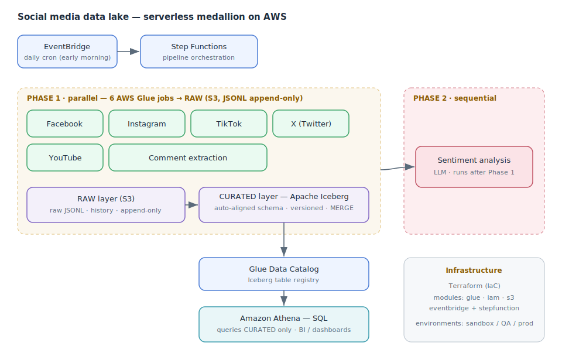
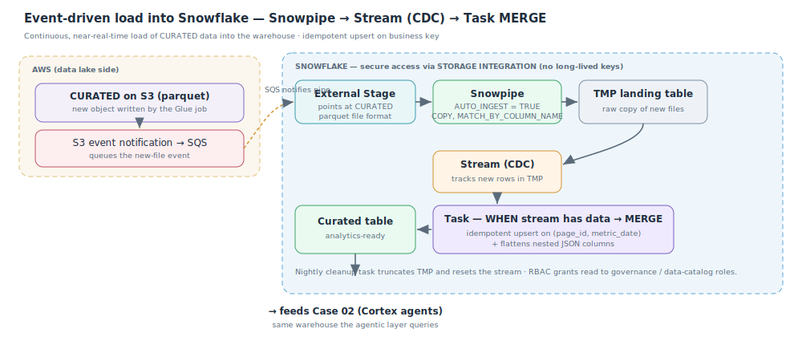

# Social media analytics data lake

**Role:** Data Architect / Analytics Engineer · **Year:** 2024–2025 · **Status:** Production

> **Confidentiality note:** case based on a real project, recreated with a generic domain and
> synthetic data. It contains no internal information, real names or production identifiers.

**One-line summary:** A serverless AWS data lake that ingests metrics from five social platforms
(Facebook, Instagram, TikTok, X and YouTube), organizes them in a *medallion* architecture with
Apache Iceberg, and exposes them for SQL querying in Athena — with automated daily orchestration, per-branch failure
alerts, an LLM sentiment stage, and **event-driven continuous load into Snowflake** (Snowpipe →
Stream → Task) that feeds the warehouse behind Case 02.

---

## 1. Problem

The content team needed a unified view of social media performance: how many posts, what reach, how
the audience evolves, and what sentiment the comments generate — across five platforms with
different APIs. Each platform returned a different, time-varying structure, and there was no single
place to cross-reference everything with SQL.

The architectural challenge was not "pull data from an API" but **sustaining a consistent analytical
model over time** when sources change their schema without warning and volumes grow daily.

## 2. Context & constraints

- Five heterogeneous sources (one API per platform), with schemas that **evolve** without notice.
- **Daily** loads (no real-time needed): a nightly batch is sufficient.
- Tight budget: **serverless** is prioritized to avoid paying for idle infrastructure.
- Need to **reprocess** historical data without corrupting already-published records.
- The final consumption is analytical (SQL/BI), not transactional.
- Third-party limits: social APIs and the LLM API have rate limits that must be respected.

## 3. Proposed architecture

A **medallion** pattern with two effective layers (RAW → CURATED) plus an optional GOLD layer for BI
aggregations. Everything serverless on S3 + Glue + Athena, orchestrated with Step Functions and
triggered by EventBridge.



**Daily flow:**

1. **EventBridge** triggers the Step Function every early morning (a single schedule, a single control point).
2. **Phase 1 — parallel:** six AWS Glue jobs run in parallel (metrics for the five platforms + comment extraction). Each writes to the **RAW** layer (JSONL on S3, append-only, exactly as it arrives from the API).
3. Each job transforms its RAW data and loads the **CURATED** layer as an **Apache Iceberg** table on S3, registered in the Glue Catalog.
4. **Phase 2 — sequential:** once the six finish, a **sentiment analysis** job runs over the comments using an LLM. It runs afterward and in series on purpose (see decisions below).
5. **Athena** queries only the CURATED layer (Iceberg) via standard SQL; BI/dashboards read from there.
6. **Failure notifications:** every state in the state machine has a `Catch (States.ALL)` that, on error, routes to a notify step which **publishes a formatted alert to an SNS topic** — so a failed branch pages the team instead of silently producing a stale table.

**On the CURATED layer (Iceberg):** the table schema is **automatically aligned** to what arrives
from RAW on each run — new columns are added (`ADD COLUMN`) and columns that stopped arriving are
removed (`DROP COLUMN`), with safeguards (partition columns are never touched, and a mass drop of
>50% of columns is blocked). This keeps the table current and free of stale columns, with no manual
intervention.

**On failure notifications (fail loud, not silent):** each Glue-job state in the Step Function is
wrapped with a `Catch` that jumps to a dedicated notify state and **publishes to an SNS topic** with
full context (execution id, state name, timestamp, job name, error type and cause). Because the catch
is per branch, a failure in one platform is reported precisely — and the parallel arm can be
retried per branch rather than rerunning the whole pipeline. The team learns about a broken run the
moment it happens, not the next morning.

**Continuous load into Snowflake (event-driven — the bridge to the warehouse):** the lake doesn't
stop at Athena. When a Glue job writes a new CURATED parquet file to S3, an **S3 event notification**
drops a message on an **SQS** queue that a Snowflake **Snowpipe** listens to (`AUTO_INGEST = TRUE`),
so the file is `COPY`-ed into a **landing table** within minutes — no polling, no scheduled job. A
**Stream** on the landing table captures the new rows (CDC), and a **Task** that fires only
`WHEN SYSTEM$STREAM_HAS_DATA(...)` runs an **idempotent `MERGE`** into the curated Snowflake table
(upsert on the business key, plus flattening of nested JSON columns). A nightly cleanup Task truncates
the landing table and resets the Stream, and **RBAC** grants read access to governance and
data-catalog roles. This is what continuously feeds the warehouse that the agentic layer in
**[Case 02](../02-agentic-analytics-warehouse/)** queries.



Representative (anonymized) shape of the Snowflake side — the same pattern for every platform:

```sql
-- Secure access to the CURATED bucket via a storage integration (no long-lived keys)
CREATE STAGE stg_metrics_page_facebook
  STORAGE_INTEGRATION = int_curated
  URL = 's3://<curated-bucket>/facebook/metrics_page_insights/'
  FILE_FORMAT = my_parquet_format;

-- Snowpipe: S3 event -> SQS -> auto COPY into a landing table
CREATE PIPE pipe_metrics_page_facebook
  AUTO_INGEST = TRUE AS
  COPY INTO tmp_metrics_page_facebook
  FROM @stg_metrics_page_facebook
  FILE_FORMAT = (FORMAT_NAME = 'my_parquet_format')
  MATCH_BY_COLUMN_NAME = CASE_INSENSITIVE;

-- CDC on the landing table
CREATE STREAM stream_metrics_page_facebook ON TABLE tmp_metrics_page_facebook;

-- Fires only when new rows arrived; idempotent upsert + JSON flattening
CREATE TASK task_load_metrics_page_facebook
  WAREHOUSE = wh_social
  WHEN SYSTEM$STREAM_HAS_DATA('stream_metrics_page_facebook') AS
  MERGE INTO tbl_metrics_page_facebook t
  USING (
    SELECT *, PARSE_JSON(page_fan_adds_by_paid_non_paid_unique):total::BIGINT AS fan_adds_total
    FROM stream_metrics_page_facebook
  ) s
  ON t.page_id = s.page_id AND t.metric_date = s.metric_date
  WHEN MATCHED THEN UPDATE SET ...        -- refresh the day's metrics
  WHEN NOT MATCHED THEN INSERT ...;       -- add new (page, date) rows

-- Nightly: reset the landing table + stream
CREATE TASK task_cleanup_metrics_page_facebook
  WAREHOUSE = wh_social
  SCHEDULE = 'USING CRON 0 1 * * * America/Bogota' AS
  BEGIN
    TRUNCATE TABLE tmp_metrics_page_facebook;
    CREATE OR REPLACE STREAM stream_metrics_page_facebook ON TABLE tmp_metrics_page_facebook;
  END;
```

## 4. Technology choices & rationale

| Decision | Chosen | Rejected | Why |
|---|---|---|---|
| Storage | **S3 + Iceberg** | Redshift / relational DB | Cheap storage decoupled from compute; Iceberg adds versioning, time travel, `MERGE`/`DELETE` and schema evolution over files, with no always-on engine. |
| Table format | **Apache Iceberg** in CURATED | Plain Parquet / Hive | Iceberg solves schema evolution and transactional per-partition writes — exactly the pain of sources that change. |
| ETL compute | **AWS Glue (PySpark/Python)** | Own server/EC2 | Serverless, scales per job, pay-per-run. No cluster to manage. |
| Query | **Athena** | Provisioned SQL engine | Pay-per-query SQL over S3; nobody maintains servers for an analyst to run a `SELECT`. |
| Orchestration | **Step Functions + EventBridge** | Self-managed Airflow | No need for an always-on Airflow for a daily batch; serverless + declarative parallel/sequential flow with native failure handling. |
| RAW & CURATED layers | **Two separate jobs** | Single RAW→CURATED job | Reprocess CURATED without hitting the APIs again, and isolate transformation failures from ingestion. |
| Sentiment | **Sequential LLM job** | Parallel with the rest | Depends on comments already being extracted, respects the LLM rate limit, and saves cost: if extraction fails, it doesn't run. |
| Failure alerting | **Step Functions `Catch` → SNS publish** | Silent failures / manual checks | Each branch notifies on failure with full context; the pipeline fails loud, and failures are retried per branch. |
| Warehouse load | **Snowpipe auto-ingest (S3 event → SQS)** | Scheduled `COPY` / batch pull | Near-real-time, event-driven, pay-per-file; no polling and no cron to babysit. |
| Warehouse access | **Storage integration** | Access keys in Snowflake | No long-lived credentials; access is granted to a role, not a key. |
| Idempotent upsert | **Stream (CDC) + Task + `MERGE`** | Full table reload each run | Only new rows are processed; restatements update in place; no duplicates. |
| Load vs. transform | **Landing table + `MERGE` to curated** | `COPY` straight into the final table | Decouples ingest from transform; enables JSON flattening and dedup before publishing. |
| Infrastructure | **Terraform** (modules) | AWS console by hand | Versioned IaC, reproducible per environment (sandbox/QA/prod), with reusable modules (glue, iam, s3, eventbridge+stepfunction). |

## 5. Cost & scalability

The whole pipeline is pay-per-use: with no data, there's almost no cost. It scales per platform by
adding a job to the parallel arm of the Step Function, without touching the rest. Date partitioning
in Iceberg keeps Athena queries cheap (they scan only the needed partitions) and avoids Athena's
writer limit by writing in batches when a run brings many dates. The real bottleneck is not compute
but the third-party API rate limits, mitigated with retries and by running the LLM stage in series.

## 6. Results / impact

- A unified analytical view of five platforms, queryable with SQL, with no servers to manage.
- The schema self-adjusts to API changes: no more silent pipeline breaks.
- Safe reprocessing thanks to the RAW/CURATED split and Iceberg versioning.
- Infrastructure reproducible per environment with a single `terraform apply`.
- Failures are alerted in real time via SNS (which job, why, when), so problems surface immediately.
- Curated data lands in Snowflake within minutes of hitting S3 (event-driven), continuously feeding the warehouse and the agentic layer of Case 02 — no batch window, no manual load.

## 7. Possible improvements

- Formalize a **GOLD** layer with aggregated, BI-ready tables (optional today).
- Declarative **data quality** (e.g. Great Expectations / Glue Data Quality) with alerts.
- Schema **contracts** per source to version API changes explicitly.
- Pipeline **observability** (freshness and volume metrics per run) and a data catalog.
- Consolidate the Stream + Task + `MERGE` into a single **Dynamic Table** for a more declarative, self-maintaining transform layer.

---

**Stack:** `AWS S3` · `Apache Iceberg` · `AWS Glue` · `Athena` · `Glue Catalog` · `Step Functions` · `EventBridge` · `SNS (failure alerts)` · `Snowflake` · `Snowpipe` · `Streams & Tasks` · `Storage Integration` · `Terraform` · `Python` · `LLM (sentiment analysis)`
