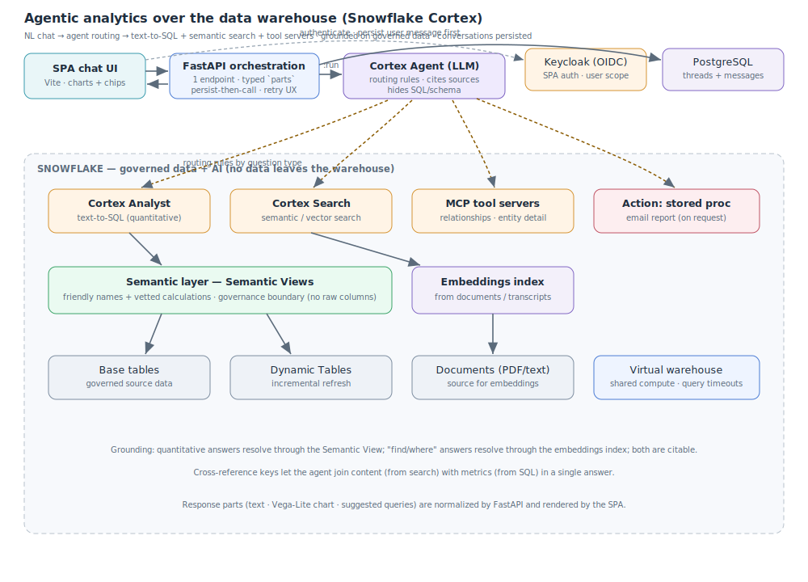

# Agentic analytics over the data warehouse

**Role:** Data Architect / AI Engineer · **Year:** 2025 · **Status:** Production

> **Confidentiality note:** case based on a real project, recreated with a generic domain and
> synthetic data. It contains no internal information, real names, business content or production
> identifiers (databases, schemas, agents, warehouses).

**One-line summary:** A conversational analytics layer where business users ask questions in natural
language and a set of **Snowflake Cortex agents** answer them by combining **text-to-SQL over a
semantic layer**, **semantic (vector) search** over documents, and **custom tool servers (MCP)** —
exposed through a thin FastAPI orchestration API (with conversations persisted per user in PostgreSQL) and a Keycloak-authenticated single-page chat UI.

---

## 1. Problem

Analysts and non-technical staff needed answers from data that lived in a warehouse (structured
tables) *and* in unstructured documents (long-form text, transcripts, PDFs). Writing SQL or grepping
documents was slow and gated on a few technical people. The goal was to let anyone ask "how is X
trending", "find where Y was mentioned", or "generate an optimal plan for Z" in plain language and
get a trustworthy, cited answer — without exposing raw table or column names.

The architectural challenge was **grounding an LLM on governed enterprise data**: the model must
answer from the warehouse, not from its own priors, and must route each question to the right tool.

## 2. Context & constraints

- Two very different data shapes: **structured** (metrics, plans, catalogs) and **unstructured**
  (documents, transcripts). One agent could not serve both well with a single tool.
- Answers must be **grounded and auditable** — no hallucinated numbers; results traceable to a row
  or a document.
- Governance: users should never see raw SQL, table names or internal identifiers.
- The data already lived in **Snowflake**; the solution should use the warehouse's own AI stack
  rather than exporting data elsewhere.
- The frontend is a normal web chat: it should not need to know anything about SQL, embeddings or
  the warehouse.
- Conversations must **survive restarts** and be scoped per user (not held in process memory).
- A warehouse call can fail mid-turn; a failure must **never lose the user's message**.

## 3. Proposed architecture

Three layers: a **data/semantic layer** in Snowflake, a **set of Cortex agents** with typed tools,
and a **thin orchestration API + SPA** in front.

**Request flow (one chat turn):**

1. The **SPA** sends `{ user_message, thread_id }` to a single backend endpoint. There is no separate
   "create thread" / "send message" — the one endpoint decides based on whether a `thread_id` exists.
2. The **FastAPI** service authenticates the user (identity via **Keycloak**) and manages
   conversation state in **PostgreSQL** (`threads` / `messages`, async connection pool). It
   **persists the user message first, then calls** the Snowflake **Cortex Agent REST API** (`:run`)
   with the thread context — so if the warehouse call fails, the turn is not lost; the SPA detects a
   user message with no assistant reply and offers a retry.
3. The **agent** (LLM orchestration model) reads the question and **routes** it to the right tool
   following explicit routing rules:
   - **Cortex Analyst (text-to-SQL)** for quantitative questions → runs SQL against a **Semantic
     View** (a governed model with friendly names and pre-defined calculations) sitting on top of
     base tables / **Dynamic Tables**.
   - **Cortex Search** for "find/where/show me" questions → semantic search over an embeddings index
     built from documents (e.g. `arctic-embed`), returning the most relevant passages.
   - **MCP tool servers** for domain-specific structured lookups that don't fit a single table
     (relationships, cross-references, entity detail).
   - An **action tool** (a stored procedure) for side effects such as emailing a formatted report,
     invoked only when the user explicitly asks.
4. The agent streams back **typed response parts** — `text`, a `chart` (Vega-Lite spec), and
   `suggested_queries` — which the backend normalizes and the SPA renders as text, charts and
   follow-up chips.

**Grounding & governance details:** the Semantic View is what makes text-to-SQL safe — it exposes
curated metrics and human-readable names, so the model never touches raw columns and answers map to
governed definitions. Response instructions force the agent to cite sources (document + date + link)
and to translate column names into natural language.

## 4. Technology choices & rationale

| Decision | Chosen | Rejected | Why |
|---|---|---|---|
| Where the AI runs | **Snowflake Cortex** (agents in the warehouse) | Export data to an external LLM/RAG stack | Keep governed data in place; no data movement, reuse warehouse security and compute. |
| Structured Q&A | **Cortex Analyst text-to-SQL over a Semantic View** | Let the LLM write SQL over raw tables | The semantic layer gives friendly names + vetted calculations → grounded, safe, no raw schema exposure. |
| Unstructured Q&A | **Cortex Search (vector/semantic index)** | Keyword search / `LIKE` | Finds by meaning across long documents and transcripts; returns citable passages. |
| Non-tabular lookups | **MCP tool servers** | Cram everything into more SQL tools | Clean separation for relationship/entity queries; each tool has one clear responsibility. |
| Side effects (email) | **Stored procedure as an agent tool** | Backend-side ad-hoc sending | The action is a governed, auditable warehouse object, invoked only on explicit request. |
| Multi-domain | **One specialized agent per domain** | A single mega-agent | Each agent has focused routing rules and tools → better routing accuracy and maintainability. |
| Orchestration API | **FastAPI proxy with thread state** | Frontend calls Cortex directly | Hides credentials, manages threads, filters internal `tool_result` noise, returns a clean typed contract. |
| API contract | **Single endpoint, typed `parts`** | Many REST endpoints | Minimal surface for the client; the same shape carries text, charts and suggestions. |
| Conversation state | **PostgreSQL (threads / messages)** | In-memory dict / localStorage | Survives restarts, scoped per user, single source of truth for history. |
| Turn durability | **Persist-then-call + retry UX** | Atomic transaction around the LLM call | The user message is saved before the (slow, external) warehouse call; a failure never loses the turn. |
| Identity | **Keycloak (OIDC)** | Ad-hoc email field | Standard SSO; `user_id` scopes every thread/message query. |
| Frontend | **SPA chat (Vite + SPA framework)** | Server-rendered app | Simple static hosting; the client only knows the one endpoint and the `parts` contract. |

## 5. Cost & scalability

Warehouse compute is the main cost lever: agents share a right-sized virtual warehouse with query
timeouts, and Dynamic Tables refresh incrementally instead of full recomputes. Cortex Search indexes
are built once and queried cheaply. The FastAPI layer is stateless (thread metadata aside) and scales
horizontally behind a load balancer. Adding a new domain means adding an agent + its tools, not
re-architecting; adding a data source means extending a Semantic View or a search index.

## 6. Results / impact

- Non-technical users get grounded, cited answers over both tables and documents, in natural language.
- No raw SQL or schema is ever exposed to end users; answers map to governed metric definitions.
- The same chat can return a number, a chart and a document citation in one turn.
- New domains plug in as new agents without touching the API or the SPA.

## 7. Possible improvements

- **Evaluation harness** for routing accuracy and answer faithfulness (golden question set).
- **Feedback loop** (thumbs up/down) persisted to improve routing rules and semantic definitions.
- **Caching** of frequent analytical questions to cut warehouse cost.
- **Observability**: per-turn tracing of which tool answered and the SQL/passages used.
- Streaming responses (token-by-token) to the SPA for lower perceived latency.

---

**Stack:** `Snowflake Cortex (Analyst / Search)` · `Semantic Views` · `Dynamic Tables` · `vector embeddings` · `MCP tool servers` · `stored procedures` · `FastAPI` · `PostgreSQL (asyncpg)` · `Keycloak (OIDC)` · `REST` · `SPA (Vite)` · `Vega-Lite`
