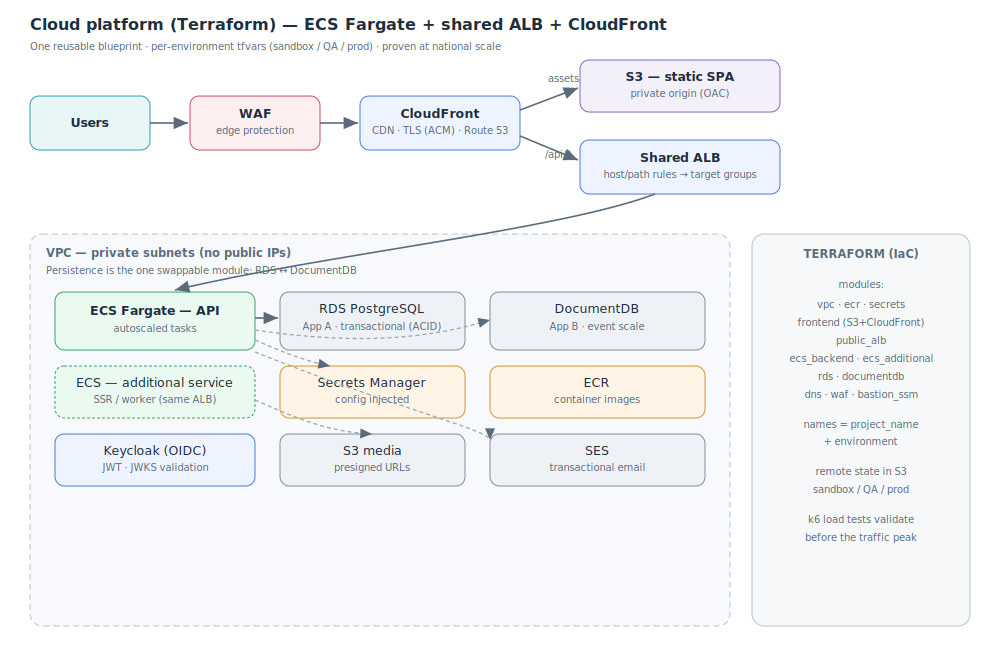

# Cloud architecture & IaC: one blueprint, two production apps

**Role:** Data / Solutions Architect · **Year:** 2025–2026 · **Status:** Production (incl. a national-scale event)

> **Confidentiality note:** case based on real projects, recreated with a generic domain and
> synthetic values. It contains no account IDs, VPC IDs, ARNs, real domains or internal information.

**One-line summary:** A reusable, environment-parametrized **Terraform** platform that deploys
containerized web apps on **AWS ECS Fargate** behind a shared **ALB**, with a **CloudFront + S3**
frontend — instantiated for **two real production apps** that share the exact same infrastructure
backbone but differ in one deliberate decision: the **persistence engine** (**RDS PostgreSQL** for a
transactional app, **DocumentDB** for a national-scale event app).

---

## 1. Problem

The organization needed to ship several web apps to production quickly and repeatably, without
hand-clicking infrastructure per app. Two concrete apps drove the design:

- **App A — internal transactional app** (an orders / approval workflow): strong, stable schema and
  relational integrity between entities.
- **App B — public app for a national-scale live event** (fan engagement: predictions, trivia,
  leaderboards): flexible, nested document model and large, spiky read traffic.

Both share the same shape (SPA + containerized API + a database), but their data needs pull in
different directions. The goal was **one infrastructure blueprint** both could instantiate per
environment (sandbox / QA / prod), swapping only what genuinely needs to differ.

The architectural challenge: make the platform **generic enough to reuse across apps** while letting
each app make the **right persistence choice** — and keep it cheap when idle but able to absorb a
national-scale spike.

## 2. Context & constraints

- Multiple apps, one small platform team → infra must be **reusable and reproducible**, not bespoke.
- App A needs **transactional integrity** and a well-defined relational schema.
- App B faces **national-scale, bursty traffic** and evolves a **flexible document model** fast.
- Cost discipline: no always-on over-provisioning; pay for what's used.
- Security baseline: private database, secrets never in code, HTTPS everywhere, WAF at the edge.
- Environments (sandbox / QA / prod) must be **identical in shape**, differing only in sizing.

## 3. Proposed architecture

A modular Terraform codebase where each module owns one concern, composed per app + environment from
a `.tfvars` file. The **only structural difference between the two apps is the database module**.

**Shared backbone (identical for both apps):**

1. Users hit **CloudFront**; static SPA assets come from a private **S3** bucket (OAC). A `/api/*`
   behavior forwards API calls to the ALB so SPA and API share one domain.
2. A **shared public ALB** (HTTP→HTTPS) routes by host/path rules to different **target groups** —
   multiple apps/services behind one balancer.
3. The API runs as **ECS Fargate** tasks in **private subnets**; images from **ECR**, config/secrets
   from **Secrets Manager**.
4. **Route 53 + ACM** for DNS/TLS, a **WAF** at the edge, and a **bastion via SSM** for break-glass DB
   access without exposing SSH.

**The one deliberate difference — persistence:**

- **App A → RDS PostgreSQL.** The orders/workflow domain has a strong relational schema and needs
  transactional integrity across related entities (orders, rates, states). A relational engine with
  ACID guarantees is the natural fit. Backend: FastAPI; auth via **Keycloak** (JWT validated against
  JWKS); **SES** for transactional email; **S3 presigned URLs** for media.
- **App B → DocumentDB.** The event domain has a flexible, nested, fast-evolving document model
  (teams/rosters, matches, trivia, user-generated content) and large read throughput at peak. A
  document store maps directly to the objects the app serves and scales reads horizontally. Backend:
  Node; validated under load with **k6** before the traffic peak.

Because everything except the DB module is shared, App B was stood up largely by pointing the same
blueprint at the `documentdb` module instead of `rds`, plus its own `.tfvars`.

**On reusability:** every resource name derives from `project_name` + `environment`, so the same code
produces isolated sandbox/QA/prod stacks. Adding an app = a new `.tfvars` (and, if it runs an extra
service like SSR, an entry in `additional_ecs_services`). Remote state lives in S3 per environment.

## 4. Technology choices & rationale

| Decision | Chosen | Rejected | Why |
|---|---|---|---|
| Compute | **ECS Fargate** | EKS / self-managed EC2 | Containers without managing servers or a Kubernetes control plane; right-sized for a small team. |
| Edge / frontend | **CloudFront + S3 (OAC)** | Serve SPA from the container | Cheap, cached, global; origin stays private; front deploys = S3 sync + cache invalidation. |
| Ingress | **One shared ALB, host/path rules** | One ALB per app | Fewer moving parts and lower cost; multiple apps/services behind one balancer. |
| DB — App A (transactional) | **RDS PostgreSQL** | DocumentDB for everything | Strong schema + ACID integrity across related entities; the orders domain is inherently relational. |
| DB — App B (event scale) | **DocumentDB** | Force it into PostgreSQL | Flexible nested document model, fast schema evolution, horizontal read scaling for national-scale peaks. |
| Config & secrets | **Secrets Manager + env** | Secrets in image / repo | Secrets never in code; rotated centrally; injected at task start. |
| IaC | **Terraform, modular, per-env tfvars** | Console / copy-paste stacks | Reproducible, reviewable, environment-parity; swapping the DB is swapping a module. |
| Identity (App A) | **Keycloak (JWT + JWKS)** | Roll-your-own auth | Standard OIDC IdP; API validates tokens statelessly against JWKS. |
| Pre-launch validation (App B) | **k6 load tests** | Hope it holds | Quantify capacity and tune scaling before a national-scale spike. |

## 5. Cost & scalability

Fargate scales task count with load and back down after peaks, so App B's national-scale event was
absorbed without permanent over-provisioning. CloudFront offloads static traffic entirely; the shared
ALB and a single ECR repo keep fixed costs low. Each app/environment is sized independently via
tfvars. The persistence layer scales on its own terms: PostgreSQL by instance class (App A),
DocumentDB by read scaling (App B). The main scaling levers — ECS desired/max count and DB sizing —
are variables, not code changes.

## 6. Results / impact

- One Terraform blueprint runs **two production apps** with different data stores, per environment,
  with a single `apply`.
- Each app uses the **right database for its domain** (relational vs. document) instead of a forced
  one-size-fits-all.
- Proven under national-scale, bursty traffic during a live event.
- Security baseline (private DB, edge WAF, secrets, HTTPS) is built in, not bolted on.

## 7. Possible improvements

- **CI/CD**: pipeline that plans on PR and applies on merge, with per-env approvals.
- **Autoscaling policies** tuned from k6 baselines (target tracking on CPU/RPS).
- **Observability**: centralized logs/metrics/traces and dashboards per service.
- **Blue/green or canary** deploys on ECS for zero-downtime releases.
- Extract the shared backbone into a versioned Terraform module consumed by both apps.

---

**Stack:** `Terraform` · `AWS ECS Fargate` · `ALB` · `CloudFront + S3` · `RDS PostgreSQL` · `DocumentDB` · `ECR` · `Secrets Manager` · `Route 53 + ACM` · `WAF` · `Keycloak` · `SES` · `k6`
