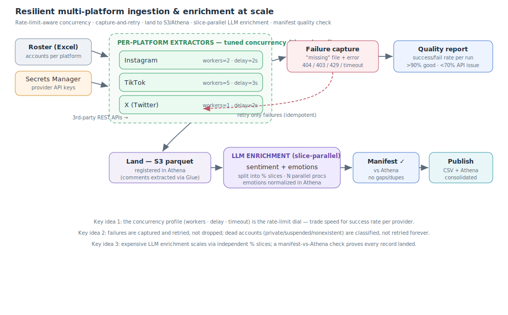

# Resilient multi-platform metrics ingestion & enrichment

**Role:** Analytics Engineer / Data Engineer · **Year:** 2024–2025 · **Status:** Production

> **Confidentiality note:** case based on a real project, recreated with a generic domain and
> synthetic data. It contains no real account names, credentials or internal information.

**One-line summary:** A rate-limit-aware ingestion pipeline that pulls follower and engagement
metrics for a roster of social accounts across Instagram, TikTok and X, survives flaky third-party
APIs through per-platform concurrency control and automatic retries, reports its own data quality,
and enriches comments with LLM sentiment before publishing.

---

## 1. Problem

The team tracked the social performance of a large roster of accounts across several platforms. The
data came from **third-party API providers** that were rate-limited, occasionally failed, and behaved
differently per platform. A naive "loop and request" script broke constantly: it hit `429` rate
limits, silently dropped accounts that were private/suspended/nonexistent, and gave no visibility
into how complete a run actually was.

The engineering challenge was **reliability against unreliable sources**: get a complete, trustworthy
dataset out of APIs that fail a meaningful fraction of the time — and *know* how complete it is.

## 2. Context & constraints

- Three platforms (Instagram, TikTok, X), each via a different provider with **different rate limits**.
- Input is a curated roster (spreadsheet of accounts); output must be clean tabular data for analysis.
- Failures are normal and heterogeneous: `429` (rate limit), `404` (doesn't exist), `403`
  (private/suspended). The pipeline must distinguish and handle them.
- Runs are periodic (batch), on datasets that can exceed hundreds of accounts.
- Credentials must not live in code.
- Downstream, comments need **sentiment enrichment** before they're useful for analysis.

## 3. Proposed architecture

A per-platform extractor pattern with a common core: **tuned concurrency → extraction → failure
capture → automatic retry → quality report → enrichment → publish**.

**Pipeline flow:**

1. **Input**: a roster spreadsheet with the accounts to track per platform.
2. **Credentials**: pulled at runtime from **AWS Secrets Manager** (one secret per provider), never
   hardcoded.
3. **Per-platform extraction**: each platform has its own extractor with a **tuned concurrency
   profile** — `max_workers`, inter-request `delay` and `timeout` set per provider to stay under its
   rate limit (e.g. X runs single-threaded, TikTok wider). Extraction runs in a **thread pool**.
4. **Failure capture**: every account that fails is written to a **"missing" file** with its error
   (`404` / `403` / `429` / timeout) — nothing is dropped silently.
5. **Automatic retry**: the pipeline compares input vs. output, re-queues only the failures, and
   retries them; genuine dead accounts (private/suspended/nonexistent) are classified rather than
   retried forever.
6. **Quality report**: each run emits a **success/failure-rate report** (e.g. "85% success, 15%
   failed") with a simple rating (>90% excellent, <70% API problems) so a run's completeness is visible.
7. **Land**: extracted comments are written to **S3 as parquet** and registered in **Athena**, so
   downstream steps query them with SQL at scale.
8. **Enrichment at scale**: an LLM enriches comments with **sentiment and emotions**. The workload is
   split into **percentage slices** and run as **parallel processes**, so large comment volumes are
   processed within the LLM's rate limits; emotion labels are then **normalized in Athena**.
9. **Completeness check**: a **manifest-vs-Athena** verification confirms every extracted comment
   actually landed in the table — catching gaps and duplicates and making reruns idempotent.
10. **Publish**: clean, timestamped datasets (CSV + Athena) ready for querying/analysis; per-platform
   outputs are consolidated.

**On resilience:** the concurrency profile is *the* rate-limit control — turning `max_workers` down
and `delay` up is how the pipeline trades speed for a higher success rate when a provider gets
stingy. Because failures are captured and retried idempotently, a partial run can be completed
instead of restarted.

## 4. Technology choices & rationale

| Decision | Chosen | Rejected | Why |
|---|---|---|---|
| Concurrency | **Thread pool with per-platform profile** | One global setting for all | Each provider has a different rate limit; per-platform `workers/delay/timeout` maximizes throughput without `429`s. |
| Failure handling | **Capture-then-retry (missing file)** | Fail the whole run / ignore errors | Nothing dropped silently; only failures are retried; a partial run can be finished, not redone. |
| Error semantics | **Classify 404 / 403 / 429 / timeout** | Treat all errors the same | A private account (403) is not a rate limit (429); each needs different handling. |
| Observability | **Per-run success-rate report** | Trust the output blindly | Makes data completeness a first-class, visible metric per run. |
| Credentials | **AWS Secrets Manager** | Keys in code / env files | Secrets never committed; rotated centrally. |
| Structure | **One extractor per platform, shared core** | One monolithic script | New platform = new extractor reusing the retry/report core. |
| Enrichment | **LLM sentiment as a separate stage** | Inline with extraction | Decouples slow/limited LLM calls from extraction; can run in parallel streams. |
| Enrichment scale | **Slice-based parallelism (% partitions)** | One big sequential pass | Moves through large comment volumes within LLM rate limits; each slice is an independent, restartable unit. |
| Landing / query | **S3 parquet + Athena** | Only local CSV | Columnar and queryable at scale; CSV kept for hand-off. |
| Completeness | **Manifest-vs-Athena verification** | Trust the writes | Confirms every extracted record landed (no gaps/dupes); makes reruns idempotent. |
| Output | **Timestamped CSV + consolidated dataset** | Overwrite in place | Auditable history; downstream tools read a stable, clean schema. |

## 5. Cost & scalability

Cost is dominated by third-party API quotas, so the concurrency profile is also the cost/throughput
dial. The pipeline scales to hundreds of accounts by batching and by running platform streams and
enrichment in parallel; for very large rosters it splits input into batches and runs off-peak. Retry
is bounded (dead accounts are classified, not retried indefinitely), so a bad provider day doesn't
create runaway cost.

## 6. Results / impact

- Complete, trustworthy datasets out of flaky APIs, with a **known** completeness per run.
- `429` rate-limit failures controlled by tuning concurrency instead of rewriting code.
- Failures triaged automatically (retry the transient, classify the dead).
- Comments delivered analysis-ready with **sentiment and emotions**, landed in S3/Athena.
- Completeness verified per run (manifest vs Athena), so gaps and duplicates are caught, not shipped.

## 7. Possible improvements

- Move orchestration to a scheduler (e.g. Step Functions / Airflow) instead of a runner script.
- Land data directly in a lake/warehouse (Iceberg/Athena) instead of CSV files — ties into Case 01.
- Persist run metrics over time to trend provider reliability and detect degradation early.
- Exponential backoff with jitter on `429` in addition to the static delay.
- Schema validation on outputs (data contracts) before publish.

---

**Stack:** `Python` · `concurrent.futures (thread pools)` · `REST APIs` · `AWS Secrets Manager` · `AWS Glue` · `S3 (parquet)` · `Athena` · `pandas` · `LLM (sentiment + emotions)` · `slice-based parallelism` · `retry & rate-limit control`
